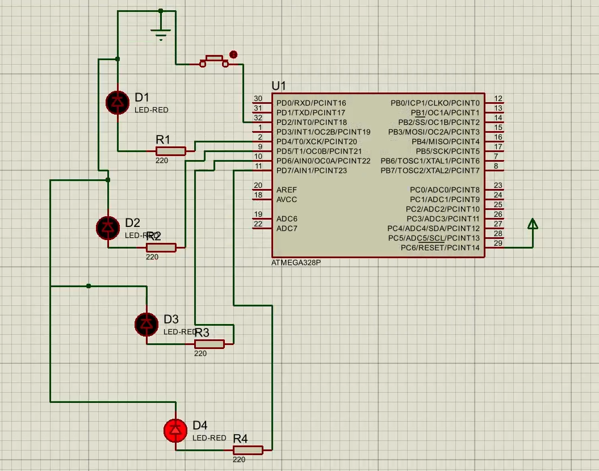
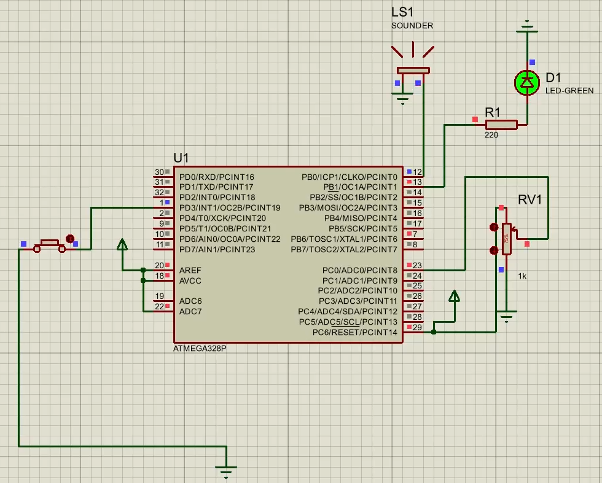
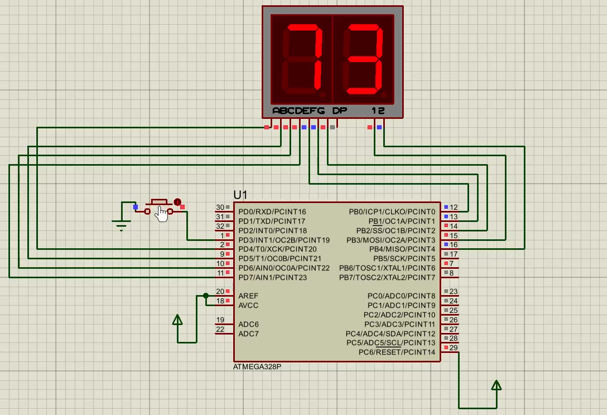

# Arduino-Based Embedded Systems Exercises

Three Arduino-based embedded systems exercises programmed in C/C++ using the Arduino IDE and verified through circuit simulation in Proteus. The repository includes the Arduino sketches, Proteus project files, and recorded simulation demonstrations.

**Project period:** February 2026 – July 2026  
**Tools:** Arduino IDE, C/C++, Proteus

## Exercises

### 1. Push-Button Controlled Sequential LED System

- Controls four LEDs using a push button and digital I/O.
- Advances through a sequence of LED states with each button press.
- Uses the Arduino's internal pull-up resistor and software switch debouncing.
- Returns to the all-off state after the final LED state.

**Files:** [`Arduino sketch`](Exercises/01-Sequential-LED/SequentialLED.ino) · [`Proteus project`](Exercises/01-Sequential-LED/Proteus1.pdsprj) · [Simulation video](Exercises/01-Sequential-LED/simulation-demo.mkv)

### 2. Potentiometer-Based LED and Buzzer Controller

- Reads an analog input from a potentiometer.
- Compares the reading against a programmed threshold.
- Maps the potentiometer value to an audible frequency using `map()` and `tone()`.
- Uses a push button to enable the controller and an LED to indicate the threshold condition.

**Files:** [`Arduino sketch`](Exercises/02-Potentiometer-LED-Buzzer/PotentiometerController.ino) · [`Proteus project`](Exercises/02-Potentiometer-LED-Buzzer/Proteus2.pdsprj) · [Simulation video](Exercises/02-Potentiometer-LED-Buzzer/simulation-demo.mkv)

### 3. Two-Digit Seven-Segment Counter

- Displays a two-digit number on a pair of seven-segment digits.
- Uses multiplexing to drive the display through digital output pins.
- Increments the count when a push button is pressed.
- Implements software debouncing and wraps the count after 99.

**Files:** [`Arduino sketch`](Exercises/03-Seven-Segment-Counter/SevenSegmentCounter.ino) · [`Proteus project`](Exercises/03-Seven-Segment-Counter/Proteus3.pdsprj) · [Simulation video](Exercises/03-Seven-Segment-Counter/simulation-demo.mkv)

## Project Gallery

<p align="center">
  
  
  
</p>

## Repository Structure

```text
.
├── README.md
└── Exercises/
    ├── 01-Sequential-LED/
    │   ├── SequentialLED.ino
    │   ├── Proteus1.pdsprj
    │   └── simulation-demo.mkv
    ├── 02-Potentiometer-LED-Buzzer/
    │   ├── PotentiometerController.ino
    │   ├── Proteus2.pdsprj
    │   └── simulation-demo.mkv
    └── 03-Seven-Segment-Counter/
        ├── SevenSegmentCounter.ino
        ├── Proteus3.pdsprj
        └── simulation-demo.mkv
```

## How to Run

1. Open the relevant `.ino` file in the Arduino IDE.
2. Select the target Arduino board and compile the sketch.
3. Open the corresponding `.pdsprj` file in a compatible version of Proteus.
4. Run the simulation and compare its behavior with the included demonstration video.

> **Note:** The repository contains Proteus project files in the supplied format. Proteus version compatibility may vary. The simulation videos are included as demonstration recordings; they are not source files for the circuit.

## Skills Demonstrated

- Arduino programming with C/C++
- Digital input/output and analog input
- Push-button handling and software debouncing
- LED and buzzer control
- Threshold detection and frequency mapping
- Seven-segment display control and multiplexing
- Embedded-system simulation and verification in Proteus

## Author

**Mohammadreza Sotoudeh**
